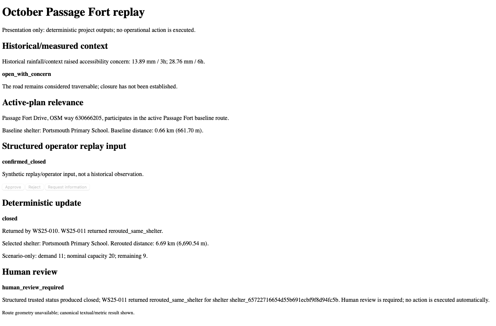

# Final Submission

## Project

**Mining Sprint — Portmore, Jamaica Rainfall-Aware Disaster Coordination MVP**

This submission demonstrates a deterministic, human-in-the-loop disaster coordination workflow built around a historical October rainfall replay for Portmore, Jamaica.

The completed MVP connects:

```text
historical October rainfall/context
        ↓
open_with_concern
        ↓
active Passage Fort evacuation route affected
        ↓
structured operator confirmation required
        ↓
synthetic confirmed_closed
        ↓
closed
        ↓
baseline route invalidated
        ↓
rerouted_same_shelter
        ↓
scenario capacity consequence
        ↓
human_review_required
```

The project is designed as a decision-support demonstration. It does not autonomously close roads, approve evacuations, dispatch resources, or execute operational actions.

---

## Submission objective

The MVP demonstrates how environmental context, structured human observations, deterministic accessibility logic, evacuation replanning, shelter-capacity consequences, and human review can be combined while preserving clear evidence boundaries.

The central design principle is that different kinds of evidence are not treated as interchangeable.

Historical rainfall can raise concern.

It does not independently prove that a road is flooded, restricted, or closed.

Explicit trusted observations can change accessibility state.

Deterministic replanning responds to that state.

Scenario assumptions can expose downstream consequences.

The workflow then stops for human review.

---

## Canonical Passage Fort replay

The final integrated demonstration uses Passage Fort as the canonical replay case.

### Location and active plan

* Community: **Passage Fort**
* Road: **Passage Fort Drive**
* OSM way: `630666205`
* Baseline shelter: **Portsmouth Primary School**
* Baseline route distance: **661.70 m**

Passage Fort Drive participates in the active Passage Fort baseline evacuation route.

### Historical rainfall context

At the replay time, the frozen rainfall lookup returns:

* **13.89 mm / 3h**
* **28.76 mm / 6h**

This rainfall context produces:

```text
open_with_concern
```

The road remains considered traversable.

Closure has not been established from rainfall alone.

### Structured operator replay input

The integrated replay then introduces:

```text
confirmed_closed
```

This is an explicitly labelled **synthetic replay/operator input**.

It is not represented as a historical observation of Passage Fort Drive.

### Deterministic accessibility update

Given the trusted structured closure observation, the accessibility-state engine returns:

```text
closed
```

### Deterministic replanning

The closed state invalidates the baseline route.

The replanning component returns:

```text
rerouted_same_shelter
```

The selected shelter remains:

**Portsmouth Primary School**

The deterministic rerouted distance is:

**6,690.54 m**

No graph topology is invented or altered to produce this result.

### Scenario capacity consequence

The replay uses the following scenario-only values:

* Scenario demand: **11**
* Nominal scenario capacity: **20**
* Remaining capacity: **9**

These values are used to demonstrate how a route change can propagate into coordination consequences.

They are not claims about observed event-day evacuation demand or verified operational shelter capacity.

### Human review

The final coordination state is:

```text
human_review_required
```

The workflow does not progress to approval or execution.

No operational action is executed automatically.

---

## Evidence and decision boundaries

The MVP deliberately separates six categories of information.

### 1. Historical / measured context

Historical rainfall data provide environmental context for the replay.

They support concern assessment.

They do not independently establish road closure.

### 2. Inference

The accessibility engine may infer:

```text
open_with_concern
```

from rainfall/context evidence.

This state preserves the concern while leaving the road traversable.

### 3. Synthetic replay input

The replay uses:

```text
confirmed_closed
```

as a structured synthetic operator observation.

This is clearly separated from historical rainfall evidence.

### 4. Deterministic project outputs

Once trusted structured input is supplied, the downstream state and replanning results are deterministic.

For the canonical replay:

```text
confirmed_closed
→ closed
→ rerouted_same_shelter
```

### 5. Scenario assumptions

Demand and shelter capacity values are used to demonstrate downstream planning consequences.

They remain explicitly scenario-only.

### 6. Human decision point

The workflow ends at:

```text
human_review_required
```

The system presents evidence and deterministic project outputs for review.

It does not itself authorize or execute an operational response.

---

## Completed MVP components

The integrated submission is built from five completed Workstream 25 components.

### WS25-009 — October rainfall

Documentation:

[ws25_009_october_rainfall.md](ws25_009_october_rainfall.md)

This component establishes the historical October rainfall context, including:

* IMERG source handling;
* local-date event interval;
* native-grid processing;
* rainfall accumulation semantics;
* frozen lookup behavior;
* explicit rainfall-only evidence boundaries.

### WS25-010 — Accessibility state

Documentation:

[ws25_010_accessibility_state.md](ws25_010_accessibility_state.md)

This component defines:

* evidence classes;
* accessibility-state precedence;
* concern handling;
* trusted explicit observations;
* routing semantics;
* the separation between rainfall concern and closure confirmation.

Rainfall/context inference can produce at most:

```text
open_with_concern
```

Trusted explicit observations are required for states such as:

```text
restricted
closed
```

### WS25-011 — Deterministic replanning

Documentation:

[ws25_011_replanning.md](ws25_011_replanning.md)

This component determines:

* whether the baseline route remains valid;
* whether deterministic rerouting is required;
* which shelter is selected;
* route distance;
* capacity consequences under the stated scenario.

For the Passage Fort replay, a synthetic trusted closure of Passage Fort Drive invalidates the baseline route and produces a same-shelter reroute to Portsmouth Primary School.

### WS25-012 — Human-in-the-loop coordination

Documentation:

[ws25_012_coordination.md](ws25_012_coordination.md)

This component coordinates structured human input with the deterministic upstream components.

It does not independently decide road accessibility, route validity, shelter selection, or capacity.

Those results remain delegated to the accessibility and replanning components.

The final state is always:

```text
human_review_required
```

There is no automated approval or execution path.

### WS25-013 — Integrated demo

Documentation:

[ws25_013_integrated_demo.md](ws25_013_integrated_demo.md)

This component presents the complete Passage Fort replay in one local demonstration.

The integrated demo shows:

* historical/measured rainfall context;
* initial accessibility concern;
* active-plan relevance;
* synthetic operator replay input;
* deterministic closure state;
* deterministic rerouting;
* scenario capacity consequence;
* final human-review requirement.

The demo remains presentation-only.

---

## Integrated demo

Launch the integrated demo from the project development environment:

```bash
python scripts/run_integrated_demo.py
```

Then open:

```text
http://127.0.0.1:8000
```

The demo presents the complete Passage Fort replay in a single interface.

Where route geometry is unavailable for presentation, the canonical textual and metric result is retained rather than inventing geometry.

---

## Replay commands

The major stages can be reproduced individually with:

```bash
python scripts/build_portmore_accessibility_state.py
python scripts/run_october_replanning.py
python scripts/run_october_coordination.py
```

The final integrated presentation is launched with:

```bash
python scripts/run_integrated_demo.py
```

---

## Validation record

Final merged-state validation completed successfully on `main`.

### Repository baseline

Latest merged MVP baseline:

```text
fe697c7 Merge pull request #11 from North-Atlas-Research/feat/ws25-013-integrated-demo
```

WS25-009 through WS25-013 are present in the merged history.

### Automated tests

Command:

```bash
pytest
```

Result:

```text
72 passed
```

### Ruff

Command:

```bash
ruff check .
```

Result:

```text
clean
```

### Git whitespace validation

Command:

```bash
git diff --check
```

Result:

```text
clean
```

### Integrated demonstration

Command:

```bash
python scripts/run_integrated_demo.py
```

Result:

The integrated demo launches successfully and reproduces the canonical Passage Fort workflow.

---

## Submission evidence

The submission-facing integrated-demo evidence is stored under:

```text
docs/assets/ws25_013/
```

The canonical screenshot shows the major evidence and decision layers in sequence:

```text
historical/measured context
→ inference
→ synthetic replay input
→ deterministic update
→ scenario consequence
→ human review
```

The screenshot should be interpreted as presentation evidence for the integrated workflow.

The deterministic replay outputs and automated validation results remain the primary reproducibility record.



---

## Reproducibility and environment

The project is designed around a reproducible Docker / VS Code Dev Container environment.

Initial host-side setup includes:

```bash
./scripts/init_external_data_dirs.sh /Volumes/ProjectSSD/Data
cp .env.example .env
```

`PROJECT_DATA_HOST` is then configured in `.env`.

The project is opened using VS Code **Reopen in Container**.

Environment verification:

```bash
python scripts/check_environment.py
```

Where routine offline container operation is applicable:

```bash
docker compose -f docker-compose.yml -f docker-compose.offline.yml up -d
```

Full setup guidance is available in:

[first_time_setup.md](first_time_setup.md)

---

## Data and provenance approach

Raw datasets are kept external to Git and mounted read-only into the project environment.

Tracked repository content contains:

* reusable processing logic;
* tests;
* configuration;
* metadata;
* documentation;
* provenance guidance;
* reproducible commands.

Relevant project documentation includes:

* [project_scope.md](project_scope.md)
* [workflow.md](workflow.md)
* [data_policy.md](data_policy.md)
* [provenance.md](provenance.md)
* [first_time_setup.md](first_time_setup.md)

This structure keeps source code and reproducibility metadata version-controlled while avoiding large raw-data artifacts in Git.

---

## Scope and limitations

This MVP is intentionally narrower than an operational flood-management platform.

It does not claim to provide:

* flood-depth estimation;
* hydraulic modelling;
* hydrodynamic modelling;
* rainfall-derived confirmation of road closure;
* calibrated road-failure probability;
* autonomous flood classification;
* observed event-day evacuation demand;
* verified operational shelter capacity;
* autonomous road closure;
* autonomous evacuation approval;
* resource dispatch;
* execution of emergency actions.

The historical rainfall layer provides environmental context.

Trusted explicit observations determine closure or restriction.

Replanning is deterministic given the resulting accessibility state.

Scenario assumptions demonstrate downstream coordination consequences.

The final decision remains subject to human review.

---

## Key design safeguards

Several safeguards are intentionally built into the demonstration.

### Rainfall is not closure

Rainfall/context can raise concern but cannot independently produce a closed or restricted road state.

### Synthetic evidence is labelled

The `confirmed_closed` observation used in the replay is explicitly identified as synthetic.

It is not blended with historical observations.

### Deterministic logic owns deterministic decisions

Accessibility state, route validity, rerouting, shelter selection, and scenario capacity calculations are produced by deterministic components rather than explanation text or presentation logic.

### Presentation does not alter decisions

The integrated interface presents upstream results.

It does not create new operational decisions.

### Human review remains terminal

The integrated workflow ends at:

```text
human_review_required
```

No approval or execution path is provided.

---

## Repository layout

```text
src/                 reusable Python package
scripts/             acquisition, processing, replay, and demo utilities
tests/               automated tests
notebooks/           exploration only; production logic belongs in src/
configs/             region and event configuration
docs/                project, workstream, provenance, and submission documentation
metadata/            tracked metadata templates/manifests
.devcontainer/       reproducible development environment
```

---

## Submission package

The final submission package is intended to include:

* the completed repository;
* the submission-facing `README.md`;
* this final submission document;
* WS25-009 through WS25-013 technical documentation;
* integrated-demo screenshot evidence;
* reproducible demo commands;
* final validation results.

No additional feature development is required for the submission unless a genuine correctness defect is discovered during final packaging verification.

### Package checklist

* [x] Judge-facing README and final submission summary
* [x] Technical documentation for WS25-009 through WS25-013
* [x] Real integrated-demo screenshot evidence
* [x] Reproduction and validation commands
* [x] Explicit provenance, scenario, and non-claim boundaries
* [ ] Project license selected by the project owner

No license file is currently tracked. Reuse or public redistribution should be confirmed with the project owner before publication.

---

## Final status

**Technical MVP: complete**

**Integrated Passage Fort replay: verified**

**Automated test suite: 72 passed**

**Ruff: clean**

**`git diff --check`: clean**

**Final workflow state: `human_review_required`**

The completed project demonstrates a traceable, deterministic, human-in-the-loop disaster coordination workflow while preserving the distinction between historical context, inferred concern, synthetic observation, deterministic system output, scenario assumptions, and human operational authority.
